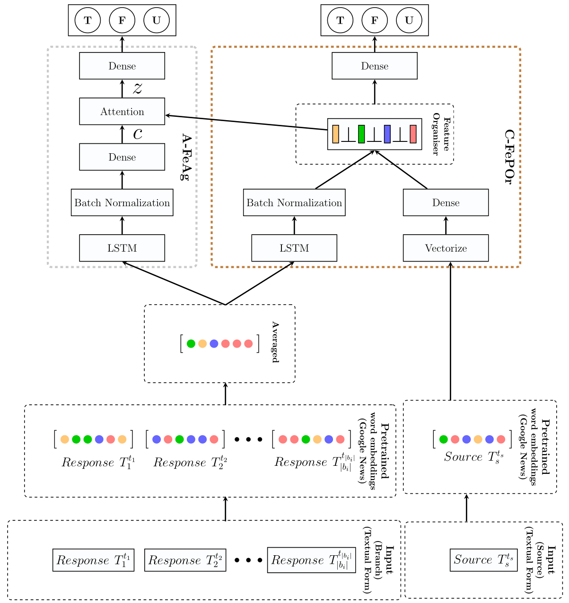

# Towards an Orthogonality Constraint-based Feature Partitioning Approach to Classify Veracity and Identify Stance Overlapping of Rumors on Twitter
## Authors : __Saswata Roy, Manish Bhanu, Sourav Dandapat, Joydeep Chandra__
###### Paper DOI is found at https://doi.org/10.1016/j.eswa.2022.118175
## Introduction
SeNoCe is an efficient Segregated Non-overlapping and Collectively exhaustive DNN model which mitigates the effects of poor utilization of resources and enhances the model performance without the aid of auxiliary information or tasks which incur good manual efforts and costs.

## If you use the code, we appreciate it if you cite our paper
~~~~
@article{roy2022towards,
  title={Towards an orthogonality constraint-based feature partitioning approach to classify veracity and identify stance overlapping of rumors on twitter},
  author={Roy, Saswata and Bhanu, Manish and Dandapat, Sourav and Chandra, Joydeep},
  journal={Expert Systems with Applications},
  pages={118175},
  year={2022},
  publisher={Elsevier}
}

~~~~

## Installation

### Prerequisite
----------------------
Python >= 3.6.

Anaconda 3

### Create Environment
Type the following command to create the environment "man" which contains all the required packages.

* conda env create -f man.yml

-----------------------

## Details

### Details of SeNoCe folder
 * The main model is kept inside the folder "SeNoCe". Neural network model is written in "neural_net.py".
 * Execute "main_model.py" file inside this folder to initiate the process.
 * Results and required files will be saved under "repo_Fast" folder.
 * Then Execute "calculate_acc_marcroF.py" file to get the Accuracy and Macro F score.
 * Use hyperopt to tune the hyperparameters of the provided model.

### Details of SeNoCe~(A-FeAg) folder
 * This folder contains the variant "SeNoCe~(A-FeAg)" which does not contain A-FeAg module.
 * Follow the similar steps of SeNoCe model to execute this variant

### Details of SeNoCe~(C-FePOr) folder
 * This folder contains the variant "SeNoCe~(C-FePOr)" which does not contain C-FePOr module.
 * Follow the similar steps of SeNoCe model to execute this variant

### Details of SeNoCe~(Source) folder
 * This folder contains the variant "SeNoCe~(Source)" which does not contain Source module.
 * Follow the similar steps of SeNoCe model to execute this variant

### Results
 * Additional Results are kept inside the "Results" folder.
 

## SeNoCe Architecture

